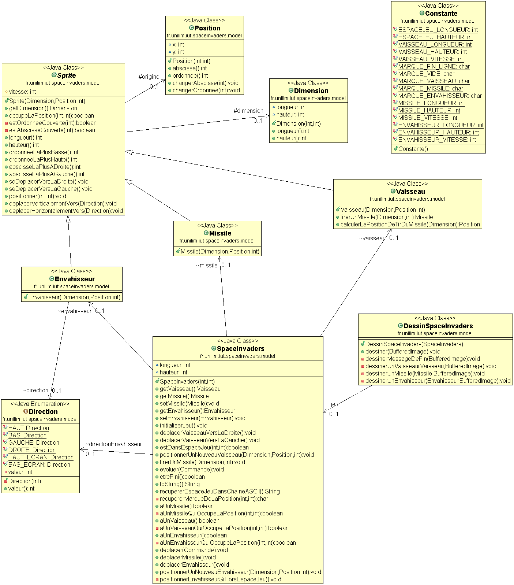

# SpaceInvaders

* [Semaine n°6: du 18 au 24 Mai](https://github.com/lucasgauvain/SpaceInvaders2.0/tree/master#semaine-n6-du-18-au-24-mai)
* [Semaine n°5: du 11 au 17 Mai](https://github.com/lucasgauvain/SpaceInvaders2.0/tree/master#semaine-n5-du-11-au-17-mai)
* [Semaine n°4: du 04 au 10 Mai](https://github.com/lucasgauvain/SpaceInvaders2.0/tree/master#semaine-n4-du-04-au-10-mai)
* [Semaine n°3: du 14 au 19 Avril](https://github.com/lucasgauvain/SpaceInvaders2.0/tree/master#semaine-n3-du-14-au-19-avril)
* [Semaine n°2: du 6 au 12 Avril](https://github.com/lucasgauvain/SpaceInvaders2.0/tree/master#semaine-n2-du-6-au-12-avril)
* [Glossaire](https://github.com/lucasgauvain/SpaceInvaders2.0/tree/master#glossaire)

## Semaine n°6: du 18 au 24 mai
### Sprints et fonctionnalités réalisées
#### Fonctionnalité n°6 : Détecter une collision entre deux sprites

* Création d'une classe collision
  
* Detecter une collision entre le missile et l'envahisseur

* Jouons ;)
  
### Diagramme de classes

### Nuage de mots 

### Difficultés rencontrées
La mise en place de la création étant donné que l'on a moins d'indications.

--------------

## Semaine n°5: du 11 au 17 mai
### Sprints et fonctionnalités réalisées
#### Fonctionnalité n°5 : Ajouter un envahisseur dans le jeu 

* Création d'une classe envahisseur
  
* Comprendre ce qu'est un envahisseur

* Mettre en forme l'envahisseur (carré rouge)
  
* Faire déplacer un envahisseur à l'horizontale de la gauche vers la droite. Il part en sens inverse au conatct des bord.

* Jouons ;)
  
### Diagramme de classes

### Nuage de mots 

### Difficultés rencontrées
La mise en place d'un envahisseur étant donné qu'il y à moins d'instruction à partir de cette 5ème fonctionnalité.

--------------

## Semaine n°4: du 04 au 10 mai
### Sprints et fonctionnalités réalisées
#### Fonctionnalité n°4 : Tirer un missile depuis le vaisseau 

* Quick Design Session : Comprendre ce qu'est un missile et refactorer (diagramme de classes) 
Création d'une classe Sprite
  
* Quick Design Session : Comprendre ce que signifie tirer un missile depuis le vaisseau (diagramme de séquence)
  
* Tirer un missile en TDD
  
* Et bien, jouons maintenant ! 
Intégration du moteur graphique a cette étape, avec un peu de retard x)

* Faire déplacer le missile à la verticale de manière autonome

* Et bien, réglons la vitesse du missile maintenant !
  
### Diagramme de classes

### Nuage de mots 

### Difficultés rencontrées
La mise en place du moteur graphique

--------------

## Semaine n°3: du 14 au 19 Avril
### Sprints et fonctionnalités réalisées
#### Fonctionnalité n°3 : Choisir la vitesse du vaisseau

* Quick Design Session : Comprendre ce qu'est la vitesse dans notre application et faire un choix de conception  
Nous choisissons de définir la vitesse comme une valeure entière.
  
* Ajouter la vitesse au Vaisseau sans régression de comportement  
  
* Régler la vitesse du vaisseau  
  
* Faire en sorte que le déplacement se fasse correctement pour une vitesse quelconque  

* Et bien, jouons maintenant !  
  
### Diagramme de classes

### Nuage de mots 

### Difficultés rencontrées
Aucune

--------------

## Semaine n°2: du 6 au 12 Avril
### Sprints et fonctionnalités réalisées
#### Fonctionnalité n°2 : Dimensionner le vaisseau

* Story n°1 : Positionner un nouveau vaisseau avec une dimension donnée  
  L'objectif va être de positionner un nouveau vaisseau au sein d'un espace de jeu donnée et refactorer le code pour le rendre plus simple et lisible.
  
* Story n°2 : Faire en sorte qu'il soit impossible de positionner un nouveau vaisseau qui déborde de l'espace de jeu  
  Ici le but sera de faire en sorte qu'une exeption soit levée lors d'un positionnement de vaisseau invalide (hors espace de jeu).
  
* Story n°3 : Déplacer un vaisseau vers la droite en tenant compte de sa dimension  
  L'objectif est de pouvoir déplacer le vaisseau vers la droite en prenant en compte sa position. Si celui-ci est à l'extrémité de l'espace de jeu ou au milieu par exemple.
  
* Story n°4 : Déplacer un vaisseau vers la gauche en tenant compte de sa dimension  
  Story identique à la précédente mais du côté gauche. Puis refactoring important dans presque toutes les classes du jeu. 
  
### Diagramme de classes

### Nuage de mots 

### Difficultés rencontrées
Aucune

--------------

## Glossaire
* **Vaisseau** : véhicule commandé par le joueur, pouvant se déplacer de droite à gauche et ayant la possibilité de lancer des missiles destinés à détruire le(s) envahisseurs.
* **Envahisseur** : ennemi qui apparaît à l'écran, se déplace automatiquement et qui doit être détruit par un missile lancé depuis le vaisseau du joueur.
* **Missile** : projectile envoyé à la verticale par le vaisseau vers l'envahisseur dans le but de le détruire.
* **Vitesse** :  vecteur obtenu en dérivant les coordonnées cartésiennes de la position par rapport au temps.. Ici, la vitesse du vaisseau est une valeure entière.
* **Sprite** :  élément graphique qui peut se déplacer sur l'écran (...) Le fond de l'écran constitue généralement le décor et les sprites sont les personnages et les objets qui se superposent au fond d'écran et qui se déplacent.
